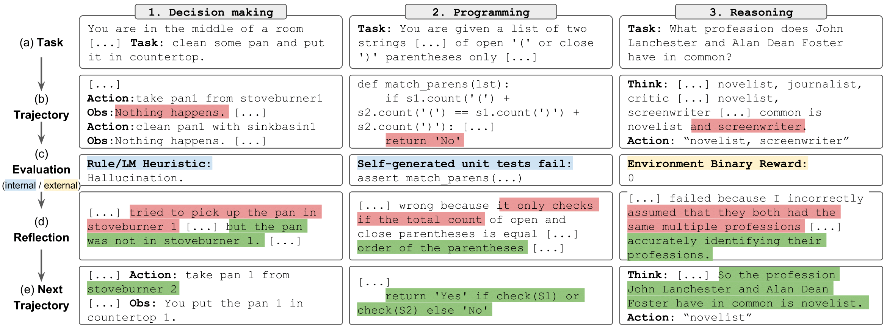

# [NeurIPS 2023] Reflexion: Language Agents with Verbal Reinforcement Learning

This repo holds the code, demos, and log files for [Reflexion: Language Agents with Verbal Reinforcement Learning](https://arxiv.org/abs/2303.11366) by Noah Shinn, Federico Cassano, Edward Berman, Ashwin Gopinath, Karthik Narasimhan, Shunyu Yao. 




We have released the LeetcodeHardGym [here](https://github.com/GammaTauAI/leetcode-hard-gym)

### To Run: reasoning (HotPotQA)
We have provided a set of notebooks to easily run, explore, and interact with the results of the reasoning experiments. Each experiment consists of a random sample of 100 questions from the HotPotQA distractor dataset. Each question in the sample is attempted by an agent with a specific type and reflexion strategy.

#### Setup

To get started:

1. Clone this repo and move to the HotPotQA directory:
```bash
git clone https://github.com/noahshinn/reflexion && cd ./hotpotqa_runs
```

2. Install the module dependencies into your environment:
```bash
pip install -r requirements.txt
```

3. Set `OPENAI_API_KEY` environment variable to your OpenAI API key:
```bash
export OPENAI_API_KEY=<your key>
```

#### Agent Types

Agent type is determined by the notebook you choose to run. The available agent types include:
 - `ReAct` - ReAct Agent

 - `CoT_context` - CoT Agent given supporting context about the question 

 - `CoT_no_context` - CoT Agent given no supporting context about the question

The notebook for each agent type is located in the `./hotpot_runs/notebooks` directory.

#### Reflexion Strategies

Each notebook allows you to specify the reflexion strategy to be used by the agents. The available reflexion strategies, which are defined in an `Enum`, include:

 - `ReflexionStrategy.NONE` - The agent is not given any information about its last attempt. 

 - `ReflexionStrategy.LAST_ATTEMPT` - The agent is given its reasoning trace from its last attempt on the question as context.

 - `ReflexionStrategy.REFLEXION` - The agent is given its self-reflection on the last attempt as context. 

 - `ReflexionStrategy.LAST_ATTEMPT_AND_REFLEXION` -  The agent is given both its reasoning trace and self-reflection on the last attempt as context.

### To Run: decision-making (AlfWorld)
Clone this repo and move to the AlfWorld directory
```bash
git clone https://github.com/noahshinn/reflexion && cd ./alfworld_runs
```

Specify the run parameters in `./run_reflexion.sh`.
`num_trials`: number of iterative learning steps
`num_envs`: number of task-environment pairs per trial
`run_name`: the name for this run
`use_memory`: use persisting memory to store self-reflections (turn off to run a baseline run)
`is_resume`: use logging directory to resume a previous run
`resume_dir`: the logging directory from which to resume the previous run
`start_trial_num`: if resume run, then the trial number of which to start

Run the trial
```bash
./run_reflexion.sh
```

The logs will be sent to `./root/<run_name>`.

### Another Note

Due to the nature of these experiments, it may not be feasible for individual developers to rerun the results as GPT-4 has limited access and significant API charges. All runs from the paper and additional results are logged in `./alfworld_runs/root` for decision-making, `./hotpotqa_runs/root` for reasoning, and `./programming_runs/root` for programming

### Other Notes

Check out the code for the original code [here](https://github.com/noahshinn/reflexion-draft)

Read a blog post [here](https://nanothoughts.substack.com/p/reflecting-on-reflexion)

Check out an interesting type-prediction implementation here: [OpenTau](https://github.com/GammaTauAI/opentau)

For all questions, contact [noahrshinn@gmail.com](noahrshinn@gmail.com)

### Cite

```bibtex
@misc{shinn2023reflexion,
      title={Reflexion: Language Agents with Verbal Reinforcement Learning}, 
      author={Noah Shinn and Federico Cassano and Edward Berman and Ashwin Gopinath and Karthik Narasimhan and Shunyu Yao},
      year={2023},
      eprint={2303.11366},
      archivePrefix={arXiv},
      primaryClass={cs.AI}
}
```
