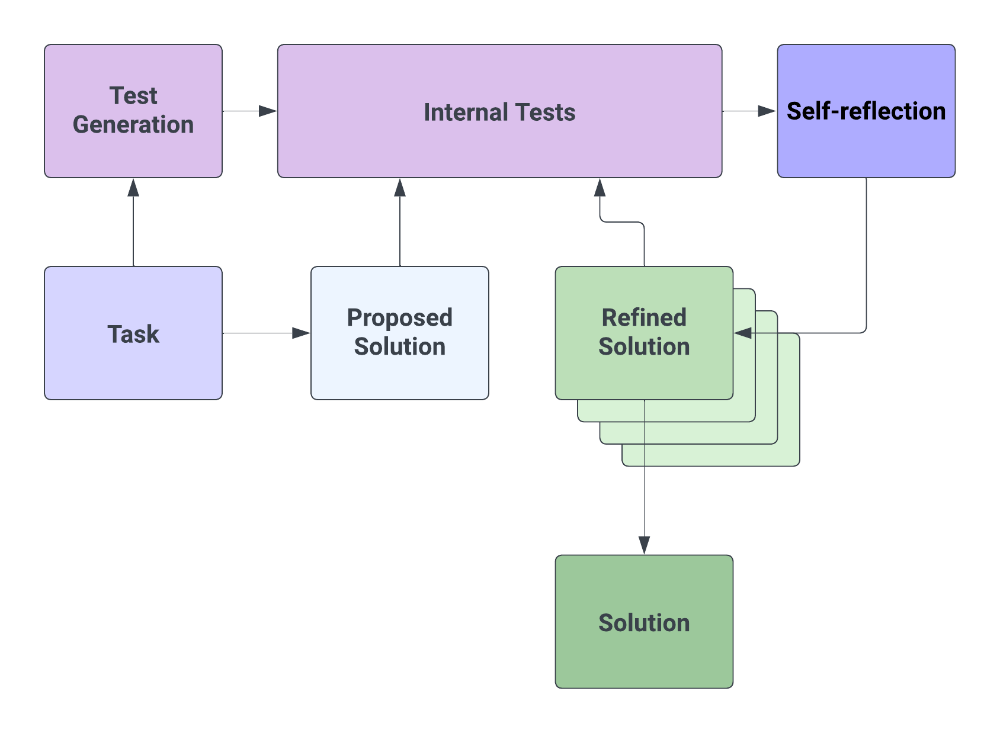

# Mastering HumanEval with Reflexion

This is a spin-off project inspired by the paper: [Reflexion: an autonomous agent with dynamic memory and self-reflection. Noah Shinn, Beck Labash, Ashwin Gopinath. _Preprint_, 2023](https://arxiv.org/abs/2303.11366)

Read more about this project in this [post](https://nanothoughts.substack.com/p/reflecting-on-reflexion).




## TL;DR


We wrote prompts to tell GPT-4 to fix code, given unit tests, and the output of the broken code. It outperforms GPT-4, when GPT-4 doesn't have access to the output of the code execution. 

Main prompts that achieve this (from [source lines](https://github.com/noahshinn024/reflexion-human-eval/blob/main/reflexion.py#L7-L12)):

```python

SIMPLE_COMPLETION_INSTRUCTION = "# Write the body of this function only."
REFLEXION_COMPLETION_INSTRUCTION = "You are CodexGPT. You will be given your past function implementation, a series of unit tests, and a hint to change the implementation appropriately. Apply the changes below by writing the body of this function only.\n\n-----"
SELF_REFLECTION_COMPLETION_INSTRUCTION = "You are CodexGPT. You will be given a function implementation and a series of unit tests. Your goal is to write a few sentences to explain why your implementation is wrong as indicated by the tests. You will need this as a hint when you try again later. Only provide the few sentence description in your answer, not the implementation.\n\n-----"
SIMPLE_CHAT_INSTRUCTION = "You are CodexGPT. You will be given a function signature and docstring. You should fill in the following text of the missing function body. For example, the first line of the completion should have 4 spaces for the indendation so that it fits syntactically with the preceding signature."
REFLEXION_CHAT_INSTRUCTION = "You are CodexGPT. You will be given your past function implementation, a series of unit tests, and a hint to change the implementation appropriately. Apply the changes below by writing the body of this function only. You should fill in the following text of the missing function body. For example, the first line of the completion should have 4 spaces for the indendation so that it fits syntactically with the preceding signature."
SELF_REFLECTION_CHAT_INSTRUCTION = "You are CodexGPT. You will be given a function implementation and a series of unit tests. Your goal is to write a few sentences to explain why your implementation is wrong as indicated by the tests. You will need this as a hint when you try again later. Only provide the few sentence description in your answer, not the implementation."

```

Inspired by [this comment](https://www.reddit.com/r/MachineLearning/comments/1215dbl/comment/jdl1bmp/?utm_source=share&utm_medium=web2x&context=3).
